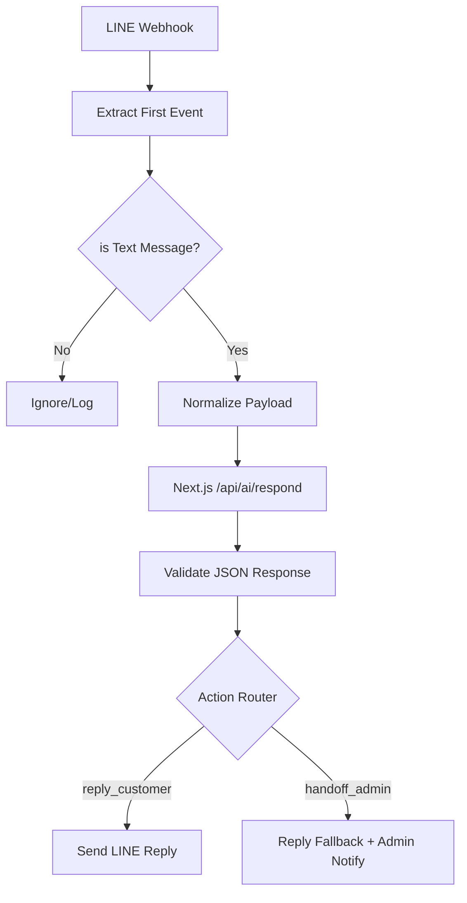

# n8n Runtime Configuration Guide (WF-RT-01)
This document outlines the step-by-step node configuration for the **LINE Runtime Integration** using n8n and the stateless Next.js AI Brain.

## Workflow Overview
The workflow (WF-RT-01) handles inbound messages from LINE, processes them via the AI Quality Gateway's brain, and routes the final action (Reply or Handoff).



## Node Details

### 1. Webhook: `line_runtime_inbound`
- **Path**: `/webhooks/line-runtime`
- **Method**: POST
- **Note**: Set the Webhook URL in [LINE Developers Console](https://developers.line.biz/).

### 2. Code: `extract_first_event`
```javascript
const body = $json;
if (!body.events || !Array.isArray(body.events) || body.events.length === 0) {
  throw new Error("Invalid LINE payload");
}
return { event: body.events[0] };
```

### 3. IF: `is_text_message`
- **Condition**: `{{ $json.event.type }}` EQUALS `message`
- **AND**: `{{ $json.event.message.type }}` EQUALS `text`

### 4. Code: `normalize_line_event`
```javascript
return {
  channel: "line",
  channelUserId: $json.event.source.userId,
  customerMessage: $json.event.message.text,
  sourceEvent: {
    replyToken: $json.event.replyToken,
    messageId: $json.event.message.id,
    timestamp: $json.event.timestamp
  },
  runtime: {
    requestId: "rt_" + new Date().getTime(),
    receivedAt: new Date().toISOString(),
    mode: "line_text_inbound"
  }
};
```

### 5. HTTP Request: `call_ai_respond`
- **URL**: `{{ $env.NEXT_APP_URL }}/api/ai/respond`
- **Method**: POST
- **Authentication**: Header `Authorization: Bearer {{ $env.INTERNAL_API_SECRET }}`
- **Body**: Input from `normalize_line_event`
- **Timeout**: 10s

### 6. Action Router (Switch)
- **Expression**: `{{ $json.recommended_action }}`
- **Cases**:
  - `reply_customer`
  - `handoff_admin`

---

## Fallback Rules
1. **API Failure**: If `call_ai_respond` fails (4xx/5xx or timeout), catch the error and execute `handoff_admin` with a static fallback message: *"ช่างกำลังตรวจสอบข้อมูลให้ครับ เดี๋ยวประสานกลับนะครับ"*.
2. **Invalid Schema**: Use the `validate_decision_json` logic to ensure the AI output isn't garbage. If invalid, treat as `handoff_admin`.

## Definition of Done for Integration
- [ ] Inbound LINE JSON yields success in `call_ai_respond`.
- [ ] No `Supabase` calls are made during the `/api/ai/respond` execution (Stateless).
- [ ] Customer receives `customer_reply` on their LINE.
- [ ] Admin receives a summary via the notification channel.
